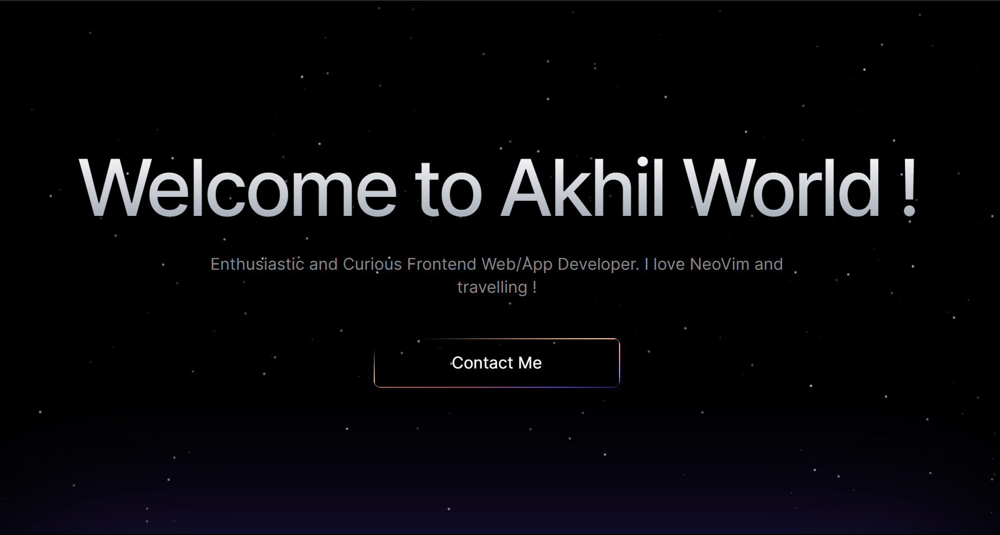

# My Portfolio 🌐



Welcome to my personal portfolio website! This project showcases my work, skills, and interests in web development and beyond. Dive into my projects, read my blogs, explore my favorite songs, and connect with me!

## ✨ Features

- **Projects:** A showcase of the projects I have worked on, highlighting my skills and contributions.
- **Skills:** A detailed overview of my technical expertise.
- **Blogs:** Written in MDX with syntax highlighting, powered by [Rehype](https://github.com/rehypejs/rehype) and [Highlight.js](https://highlightjs.org/).
- **Favorite Songs:** A curated list of my favorite tracks to share my musical taste.
- **Resume:** Easy access to my resume.
- **Social Links:** Links to my profiles on various platforms to connect with me.

## 🛠️ Tech Stack

- **Framework:** [Next.js](https://nextjs.org/)
- **Styling:** [Tailwind CSS](https://tailwindcss.com/)
- **Type Safety:** [TypeScript](https://www.typescriptlang.org/)
- **Markdown Rendering:** [Rehype](https://github.com/rehypejs/rehype) and [MDX](https://mdxjs.com/)
- **Syntax Highlighting:** [Highlight.js](https://highlightjs.org/)
- **Animations:** [Framer Motion](https://www.framer.com/motion/)

## 🚀 Getting Started

Follow these steps to run the project locally:

1. Clone the repository:

   ```bash
   git clone https://github.com/akhil683/Whose_Portfolio.git
   cd Whose_Portfolio
   ```

2. Install dependencies:

   ```bash
   npm install
   ```

3. Start the development server:

   ```bash
   npm run dev
   ```

4. Open the app in your browser at [http://localhost:3000](http://localhost:3000).

## 📜 License

This project is licensed under the MIT License. See the LICENSE file for details.

## 🤝 Contributing

Contributions are welcome! Feel free to fork the repository, make changes, and submit a pull request.

## 🎯 Live Demo

Check out the live version of my portfolio [here](https://yourportfolio.com).

## 📧 Contact

Feel free to reach out to me for collaboration or just to say hi! You can connect with me on [LinkedIn](https://linkedin.com) or via email at your.email@example.com.

