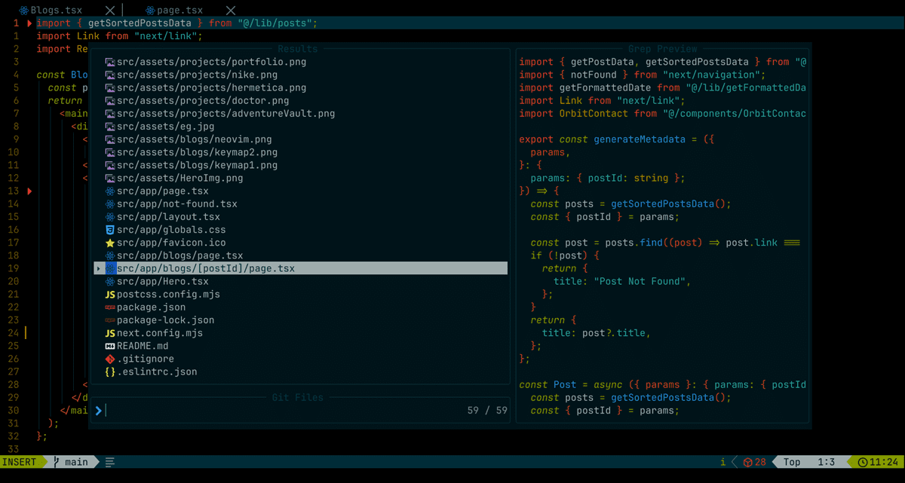

When I first started coding, **Visual Studio Code (VSCode)** was my editor of choice. It's widely regarded as the industry standard, and I was
more than satisfied with its performance, especially on my new laptop.
I didn’t feel it lacked anything crucial, and its speed was adequate
for my needs. At that time, my focus was on improving my typing speed,
aiming for over _150 words per minute (wpm)_, believing that faster
typing equated to higher _productivity_. However, I often found myself
relying heavily on the mouse for various tasks within VSCode, which I
realized later was holding me back from reaching my full potential.

### Discovering Neovim

One day, while browsing YouTube, I stumbled upon a channel called
**[ThePrimeAgen](https://www.youtube.com/@ThePrimeTime)**
. I was mesmerized by the speed and efficiency with which he navigated
his editor, which looked nothing like VSCode. I noticed he rarely used
the mouse for tasks such as creating or switching files. Intrigued, I
discovered that he was using Neovim. This revelation led me down a
rabbit hole of Neovim tutorials and showcases, and I was thoroughly
impressed. Motivated by what I saw, I decided to make the switch to
Neovim.

### First Attempt: Big Mistake

My initial attempt to install Neovim directly on my laptop was a
_disaster._ There's a common saying, **"I don't know how to exit Vim"**
which rang true for me. Coming from a VSCode background, I struggled
to even exit Neovim, let alone use it effectively. I encountered
numerous errors, and there was a lack of coding suggestions, which led
to frustration. Consequently, I _uninstalled Neovim_. Despite this
setback, I continued to watch ThePrimeAgen's videos, drawn by his
speed and efficiency.

### Vim Motion in VSCode

As a relatively new coder, I was not understanding him but still
continued to watch his video because I was always impressed by his
speed and efficiency. Inspired by him, I decided to incorporate Vim
motions into my VSCode setup. I installed a Vim extension in VSCode
and forced myself to learn **Vim motions** by selling my mouse to a
friend. For almost a year, this hybrid setup worked well for me.
However, as I customized VSCode further and used Vim commands for
almost everything, I noticed a decline in _performance_. The lag became
unbearable, prompting me to reconsider switching to Neovim.

### Successful Transition and Configuration

After so many unsuccessfull attempts, this time transition was
smoother. After switching to **Clang/LLVM** as my C compiler, Neovim
installed without any issues. I opted for
[LazyVim](https://www.lazyvim.github.io)
to avoid the _time-consuming_ task of writing my configuration from
scratch. Then, I customized it with keymaps to suit my needs. Within a
few days, I experienced a level of speed and efficiency that I had
never felt with VSCode. Tasks like creating or deleting files, which
used to lag in VSCode, were now seamless in Neovim. I may not be as
fast as _ThePrimeAgen_, but I'm blazing through my work at my own pace.

### Enhancing Workflow with Harpoon and Telescope

To further enhance my workflow, I installed [Harpoon](https://www.github.com/primeagen/harpoon). While
[Telescope](https://github.com) is a fantastic fuzzy finder, I found Harpoon invaluable for focusing
on a few files at a time. **Harpoon** also support **tmux** out of the box
which is a terminal multiplexer. But I use windows, so I can't use
tmux. With _Harpoon_, I can mark files that I want to re-visit later and
quickly switch between those frequently used files, boosting my
productivity. The combination of tools has significantly streamlined
my workflow.

### Conclusion

Now, having used Neovim extensively, I can't imagine going back to
VSCode. Neovim's performance is buttery smooth, and it has
fundamentally changed how I interact with my laptop. I rely almost
entirely on the keyboard, rarely touching the mouse. I've also
customized Neovim with various extensions and **Language Server
Protocols (LSP)** to fit my coding needs perfectly. I may not be as fast
as ThePrimeAgen, but I'm blazing through my work at my own pace. You
can check out my keymaps below -

Thank you for reading and let me know if you enjoyed this post !
